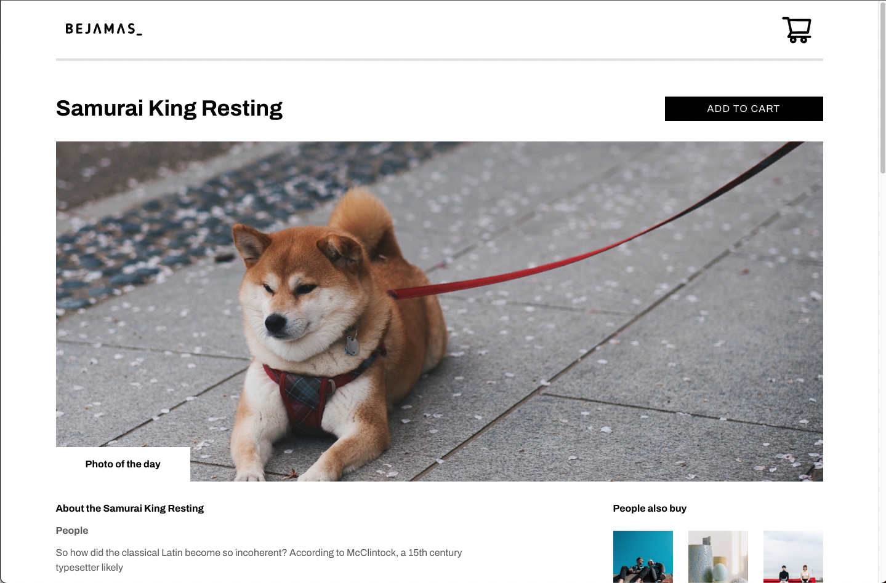

# Graph Store 📷
Graph Store is your favorite online photo store made with Next.js and GraphQL and integrated with GraphCMS 📷 <br />

<p align="center" t>
  
</p>

Live preview: https://graph-store-r0ce8jdil-andrecampll.vercel.app/

# Tecnologies 🚀
Next.js ⚛️ <br />
Apollo GraphQL ⚛️ <br />
GraphCMS ⚛️ <br />
Codegen ⚛️ <br />
Chakra UI 🥷 <br />
Typescript 🦕

# Getting Started 🤓
First, run Codegen to generate GraphQL hooks and types:

```bash
npm run gen
# or
yarn gen
```
Second, run the development server:

```bash
npm run dev
# or
yarn dev
```

Open your browser at `localhost:3000`

# How to contribute? 😍
**Fork this repository**
```bash
# Clone your fork
$ git clone your-fork-url && cd graph-store

# Create a branch with your feature or bug fix
$ git checkout -b my-branch

# Commit your changes
$ git commit -m 'my changes'

# Push your branch
$ git push origin my-branch
```

Delete your branch, if you want, when your pull request merge. <br />

Made with 💜 by <a href="https://www.linkedin.com/in/andrecampll/" target="_blank"> andrecampll </a>. <br />
<br />
